# Transit Gateway Automation
This repository provides you with the code base allowing to test the Transit Gateway automation system that is presented at the AWS re:invent 2020. EnJoY!
In order to better leverage this solution, it is nice to either have seen the AWS re:invent session or read the [Transit Gateway blog posts](https://blog.revolve.team/2020/11/05/focus-sur-aws-transit-gateway-partie-2/) that you can find on the Devoteam|Revolve website.

# Table of Contents
1. [Disclaimer](#disclaimer)
2. [Solution overview](#solution-overview)
3. [Installation instructions](#installation-instructions)
4. [Create a new VPC](#create-a-new-vpc)
5. [How to add a new bubble](#how-to-add-a-new-bubble)
6. [How to force the update of a deployment](#how-to-force-the-update-of-a-deployment)
7. [How to change the VPC](#how-to-change-the-VPC)
8. [Why is the update failing when I update parameters other than the bubble name?](#why-is-the-update-failing-when-i-update-parameters-other-than-the-bubble-name)

# Disclaimer
Although I did my best to make this repository useful and understandable, I'm relying on the fact that you are already black-belt of CloudFormation. Indeed, even if I provide CloudFormation code in this README, I do not explain it to much and I take for granted that you do know how to read and interpret it.

# Solution overview
The initial setup will roughly look like this:
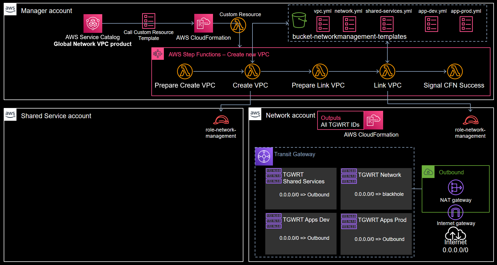
The important thing to note is that we distinguish between 3 different account types:
- The **Network** account is hosting the Transit Gateway and its initial setup (that is, Routing Tables corresponding to **bubbles** and the Outbound VPC allowing to reach the Internet);
- The **Managed** accounts (e.g. Shared Services) are the accounts in which we will create VPCs that we want to attach to the TransitGateway;
- The **Manager** account is the one that perform all the magic, it hosts the Step Functions that will coordinate the actions in both the Network account and a Managed account in order to create and attach a new VPC to the Transit Gateway.

Note that for testing purposes, **you can use the same AWS account to perform those 3 roles** !

If you wonder what the f*** is a "Bubble", you should read [this blog post](https://blog.revolve.team/2020/11/05/focus-sur-aws-transit-gateway-partie-2/). It is in French, and you may not be fluent in French, but I tried the Google Translation to English and it seemed pretty understandable.

Anyway, at the end of the creation process, the situation looks like this if you create a Shared Service VPC:
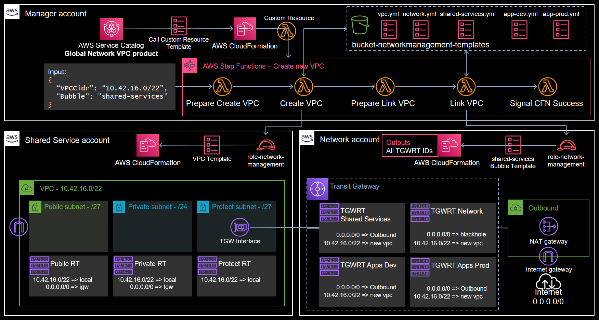

# Installation instructions
Ok lets setup this thing.

## Assign accounts to different roles
First, be clear about which AWS accounts you want to use to perform each of the 3 roles described above:
- Network (1 account)
- Manager (1 account)
- Managed (multiple accounts)

In this guide, I will assume that you use the same AWS account for all 3 roles, but you can also do it with different accounts. Obviously I would even **recommend** to separate the roles in different AWS accounts for a production environment.

## Prepare the *Managed* accounts
First thing first, something must be done in all the *Managed* accounts and the *Network* account.
The *Manager* account needs an AWS IAM Role in order to perform the different tasks that are needed to create and attach a VPC to a Transit Gateway.

### 1. Use the CloudFormation template *cloudformation/all-managed-accounts/role-network-management.yml* in order to create the IAM Role needed.
The template is very simple, it creates an IAM Role that trust the *Manager* account to assume it.

Here are the parameters:
| Parameter             | Default Value           | Description |
|:----------------------|-------------------------|:------------|
| ManagerAccountId      | Current account ID*     | The AWS account ID of the *Manager* account that will assume the role|
| ConfigurationRoleName | role-network-management | The role name. If you change it, keep the new name close to you as you will need it later.|

\* *It is not a CloudFormation default value, but it is the value that will be used if the parameter is left empty*

The role has two policies attached: NetworkAdministrator and AWSCloudFormationFullAccess allowing it to Create/Update/Delete the stacks we need, and furthermore to manage the VPCs (and sub-resources like subnets, route tables and so on)

For this test, you can leave all parameter values as they are when creating the stack.

In an AWS Organization context with dozens or hundreds of AWS accounts, you should consider using [StackSets](https://docs.aws.amazon.com/organizations/latest/userguide/services-that-can-integrate-cloudformation.html) to deploy this IAM role everywhere.

## Prepare the *Network* account
The *Network* account must already have the foundations laid out for this system to work: the Transit Gateway and all the "Bubbles" (i.e. the Transit Gateway Route Tables) must exist before we attempt the create any VPC.
Additionally, we will also create the *Outbound* VPC that will provide Internet access to VPCs attached to the Transit Gateway. This is only required in our use-case, if you understand French don't hesitate to spend 30 minutes watching [this talk](https://www.youtube.com/watch?v=v6Izn56oQbY) to understand why.

### 2. Use the CloudFormation template *cloudformation/network-account/transit-gateway-and-outbound.yml* in order to create the TransitGateway and the *Outbound* VPC
Here are the parameters:
| Parameter       | Default Value | Description |
|:----------------|---------------|:------------|
| NameAfix        | reinvent      | An afix that is used in the name of virtually every resources created by this template. You can change it to whatever you like as long as it only contains alphanumerical chars. If you change it, keep the new value close to you as you will need it later.|
| OrganizationArn | None          | The **ARN** of the AWS Organization with which we want to share the Transit Gateway through Resource Access Manager. It is only required if you want to make this work in a multi-accounts context and it will only works if the Network account belong to the AWS Organization. If left empty, the Transit Gateway is not shared.|

For this test, you can leave all parameter values as they are when creating the stack.

## Prepare the *Manager* account
This is the corner-stone of the whole system. The *Manager* account will host the [Step Functions](https://docs.aws.amazon.com/step-functions/latest/dg/welcome.html) and [Lambdas](https://docs.aws.amazon.com/lambda/latest/dg/welcome.html) that make all of this work. In addition, it will also host the S3 Bucket that will contain the CloudFormation templates used by the system.

### 3. Use the CloudFormation template *cloudformation/manager-account/network-management-backend.yml* in order to create the backend management system
This is a fairly heavy template that will create the following:
- An S3 bucket that will host CloudFormation templates, see further;
- A Lambda written in Python 3 (and its role) that is intended to be used as a [CloudFormation Custom Resource](https://docs.aws.amazon.com/AWSCloudFormation/latest/UserGuide/template-custom-resources.html);
- Three Step Functions State Machines (and their shared role) that will be used to perform the Create/Update/Delete operations of the above Custom Resource Lambda;
- A bunch of Lambdas (written in Python 3) that will be called by the State Machines. Most of them share the same IAM Role allowing them to assume the role created at Step 1 in the managed accounts and to read objects from the S3 Bucket created by this template.

All the Lambda's source codes are directly inside the template, which is not really easy to read but also avoid the need for 9 more installation steps :)

Here are the parameters:
| Parameter             | Default Value           | Description |
|:----------------------|-------------------------|:------------|
| NameAfix              | reinvent                | An afix that is used in the name of virtually every resources created by this template. You can change it to whatever you like but **it must be the same value as the one used at step 2**.|
| NetworkAccountId      | Current account ID*     | The account ID of the *Network* account, in which we will find the Transit Gateway.|
| ConfigurationRoleName | role-network-management | The name of the role used to go in the *Managed* accounts and the *Network* account. **It must be the same value as the one used at step 1**.|

\* *It is not a CloudFormation default value, but it is the value that will be used if the parameter is left empty*

For this test, you can leave all parameter values as they are when creating the stack.

### 4. Copy the templates in *cloudformation/manager-account/vpc-and-bubble-stacks/* to the S3 bucket
Well. The title kind of speak for itself. Copy all the templates into the S3 bucket created by the stack at step 3, it is named **{NameAfix}-networkmanagement-templates-{RandomString}**.

### 5. (Optional) Create a Service Catalog product that will help with VPC creations
This step is optional because technically you can use the CloudFormation template *cloudformation/manager-account/template service-catalog-template-global-vpc.yml* in order to create stacks yourself.

Additionnaly, know that since AWS changed the way Service Catalog is billed (it is now billed based on the number of requests made to the service) the cost of experimenting has sky-rocketed: you will easily reach 30-40$ of Service Catalog if you play with this system and spend hoursin the Service Catalog console creating and destroying products, like I did.
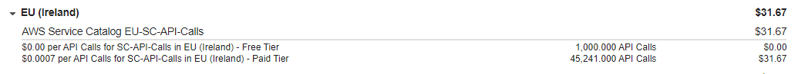
I'm not sure why it is like that but my guess is that the Service Catalog console is just shitty and it launches thousands of requests for nothing.

That being said, here is how to create the SC product. All those steps still happens in the *Manager* account:
1. Go in the Service Catalog console and create a portfolio
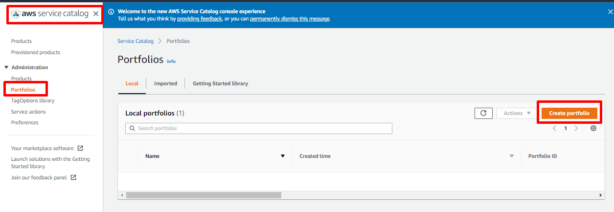
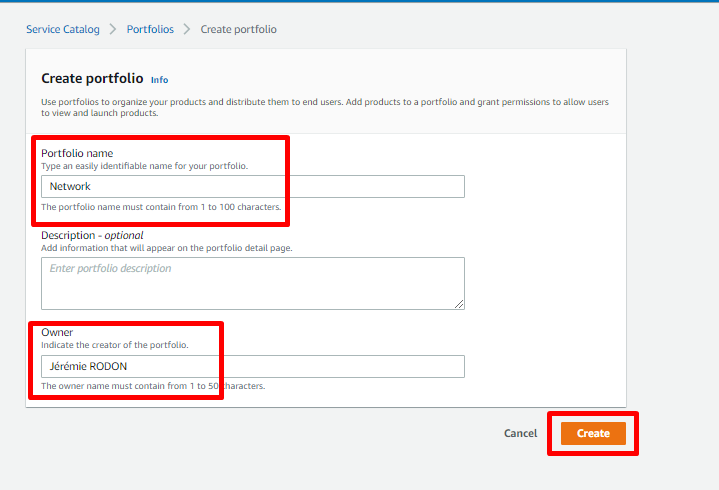
Of course, change the values to what suits you best.
PS: Even if you keep my name as the owner, I will not feel obliged to provide support to your users :D
2. Associate it with IAM identities
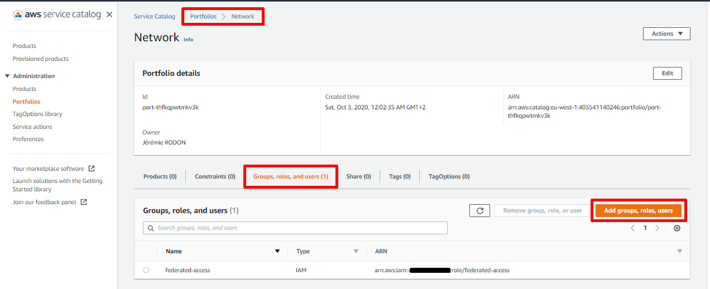
3. Create the product
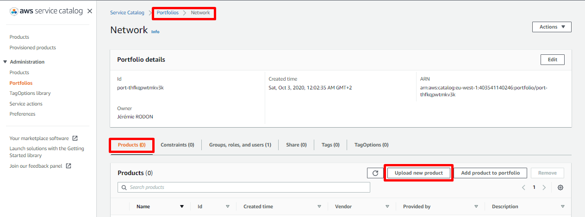
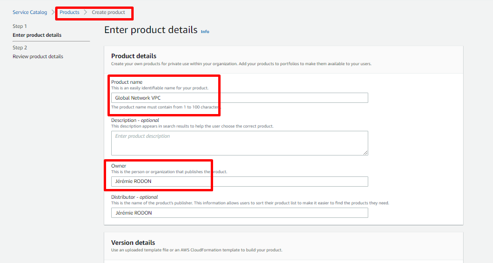
Again, use your own values
4. Use the template in *cloudformation/manager-account/template service-catalog-template-global-vpc.yml*
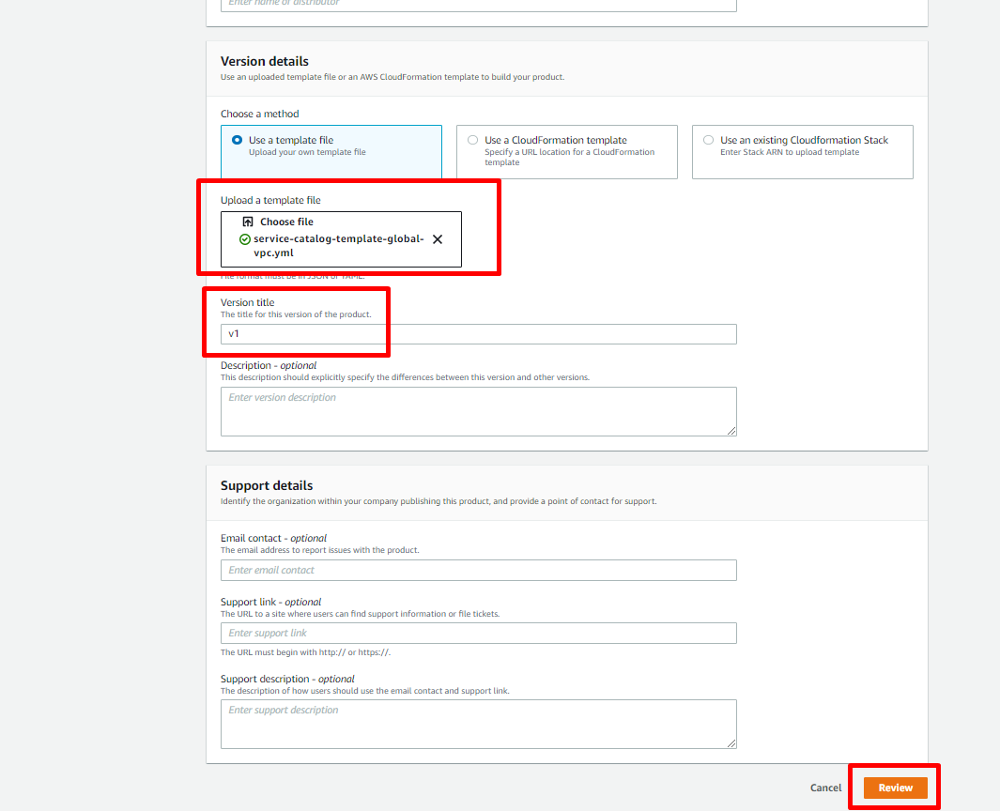
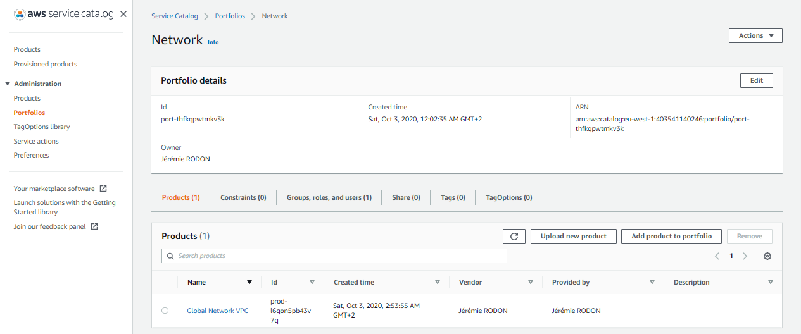
5. And that's it, you got your Service Catalog product, as a Service Catalog user, you should see the Product and be able to launch it.
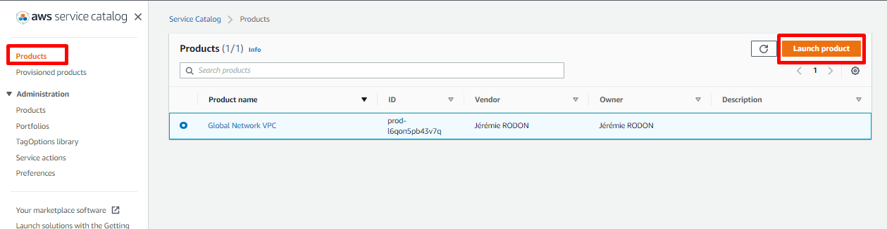
If you dont see it, make sure you associated you user/role or one of your groups at the step 2 of the creation.

# Create a new VPC
In order to create a new VPC, you need to Launch the Service Catalog product created previously **or** create a CloudFormation stack yourself (in the *Manager* account) using the template *cloudformation/manager-account/template service-catalog-template-global-vpc.yml*.
> /!\ If you want to create the stack yourself et used the same AWS account for all roles, you need to be careful that the stack name you choose does not conflict with those the system will attempt to create. It will depend on the value of the AppName parameter (see further), but the two stacks created by the system will be named:
>- VPC-{AppName}
>- Bubble-{AppName}

Either way, the only thing that matter is the values you will set for the template parameters.
Here are the parameters:
| Parameter            | Default Value       | Description |
|:---------------------|---------------------|:------------|
| AppName              | None                | The name (or more accurately the base name) that will be used to tag the resources created. It will also be used to name the sub-stacks created by the system. |
| VPCCidr              | None                | The CIDR block of the new VPC. You can use any CIDR between /16 (maximum allowed by AWS) and /23 (minimum allowed by the way we divide the block for subnets). The VPC will be divided into 9 subnets: 3 publics, 3 private and 3 protected (without any Internet access). Only the 3 private subnets will be routed to the Transit Gateway. This may not suit your needs, we will discuss how to change that below |
| AccountID            | Current account ID* | The ID of the *Managed* account in which we want to deploy the new VPC. |
| Region               | Current region*     | The AWS region in which we want to deploy the new VPC. It must be the region where the Transit Gateway has been created in the *Network* account.   |
| NetworkBubble        | shared-services     | The name of the "Bubble" to which this new VPC will belong. The value you can set here are limited by the template to avoid error. This value is directly use by the system to retrieve the CloudFormation template corresponding to the bubble from S3: it will try to get **{NetworkBubble}.yml** from S3 |
| ForceUpdateParameter | None                | An apparently useless parameter, but obviously it would not be here if it really *was* useless. See further.   |

\* *It is not a CloudFormation default value, but it is the value that will be used if the parameter is left empty*

Once you chose your values, wait and see. At the end, you should have a fully ready VPC, attached to the Transit Gateway and routed according to the Bubble you picked! 

# How to add a new bubble
Let say you have a new kind of need, you did the Bubble definition process again, and it appears you need to create a new bubble. This new bubble will be named "New Bubble" (yeah, I know I have so much imagination). This is how to do it.

### 1. A new bubble means a new Transit Gateway Route Table
First thing first, you new to modify the *cloudformation/network-account/transit-gateway-and-outbound.yml* in order to create a new Transit Gateway Route Table for your new bubble. The current TGWRTs are all defined in the beginning of the template.
You add that in the `Resources` section
```
# The Application RouteTable will be attached to the various application VPC
# It will not allow app to app communication, only communications to Network and Shared Services
  NewBubbleTGWRouteTable:
    Type: AWS::EC2::TransitGatewayRouteTable
    Properties:
      TransitGatewayId: !Ref TransitGateway
      Tags:
        - Key: Name
          Value: !Sub tgwrt-${NameAfix}-new-bubble
  NewBubbleTGWRouteTableDefaultRoute:
    Type: AWS::EC2::TransitGatewayRoute
    Properties:
      Blackhole: false
      DestinationCidrBlock: 0.0.0.0/0
      TransitGatewayAttachmentId: !Ref EgressVPCTGWAttachement
      TransitGatewayRouteTableId: !Ref NewBubbleTGWRouteTable
```
Also, you **must** export the new TGWRT ID in order for the management system to find it. This time, you go at the end of the template in the `Outputs` section and you add:
```
  NewBubbleTGWRTID:
    Description: ID of a TGW Route Table for future reference
    Value: !Ref NewBubbleTGWRouteTable
    Export:
      Name: NewBubbleTGWRTID
```

Once the template is modified, update the corresponding stack in the *Network* account.

### 2. A new bubble means a new bubble template
Create a new template in *cloudformation/manager-account/vpc-and-bubble-stacks/*, you should probably just duplicate an existing bubble template for starter. Name your new template *new-bubble.yml*, open it and change the description.

**DO NOT CHANGE EVEN A COMMA IN THE `Parameters` SECTION**

If you duplicated an existing bubble template, there is 3 "blocks" in the `Resources` section: Association, Propagations and Black holes. The association will be with the TGW RT you create in the previous step. Propagations and Black holes are entirely dependent on the interactions between this new bubble and the existing ones.
Again, you may read [this blog post](https://blog.revolve.team/2020/11/05/focus-sur-aws-transit-gateway-partie-2/) to understand how "Bubble" works (in French, use Google Translate for English).

For the sake of example, let us say your new bubble interactions are as follow:
| Bubble talks ?      | Networks | Shared Services | Apps Dev | Apps Prod | New Bubble |
|--------------------:|:--------:|:---------------:|:--------:|:---------:|:----------:|
| **Networks**        | No       | Yes             | Yes      | Yes       | Yes        |
| **Shared Services** | Yes      | Yes             | Yes      | Yes       | Yes        |
| **Apps Dev**        | Yes      | Yes             | No       | No        | Yes        |
| **Apps Prod**       | Yes      | Yes             | No       | No        | No         |
| **New Bubble**      | **Yes**  | **Yes**         | **Yes**  | **No**    | **Yes**    |

We will not dwell upon the usefulness of such a bubble, that is not our topic (but it appears to be a kind of Shared Services dedicated to Dev).

Once the table is filled, the new template becomes crystal-clear:
```
AWSTemplateFormatVersion: 2010-09-09
Description: |
  New Bubble bubble. After a new App VPC is attached to
  the TGW, handle the TGW RT configurations.

Parameters:
  NewAttachmentID:
    Type: String
    Description: The ID of the attachment
  NewAttachmentCIDRBlock:
    Type: String
    Description: The CIDRBlock of the VPC behind the attachment

Resources:
###############
# Association #
###############
  # Associate the New Bubble route table to the new attachment
  NewBubbleRouteTableAssociation:
    Type: AWS::EC2::TransitGatewayRouteTableAssociation
    Properties:
      TransitGatewayAttachmentId: !Ref NewAttachmentID
      TransitGatewayRouteTableId: !ImportValue NewBubbleTGWRTID

################
# Propagations #
################
  # "Propagate" the CIDRblock on the Network route table
  NetworkTGWRouteTableRoutePropagation:
    Type: AWS::EC2::TransitGatewayRouteTablePropagation
    Properties:
      TransitGatewayAttachmentId: !Ref NewAttachmentID
      TransitGatewayRouteTableId: !ImportValue NetworkTGWRTID
  # "Propagate" the CIDRblock on the Shared Service route table
  SharedServicesTGWRouteTableRoutePropagation:
    Type: AWS::EC2::TransitGatewayRouteTablePropagation
    Properties:
      TransitGatewayAttachmentId: !Ref NewAttachmentID
      TransitGatewayRouteTableId: !ImportValue SharedServicesTGWRTID
  # "Propagate" the CIDRblock on the AppIsolated Dev Route Table
  AppIsolatedDevTGWRouteTablePropagation:
    Type: AWS::EC2::TransitGatewayRouteTablePropagation
    Properties:
      TransitGatewayAttachmentId: !Ref NewAttachmentID
      TransitGatewayRouteTableId: !ImportValue AppIsolatedDevTGWRTID
  # "Propagate" the CIDRblock on the New Bubble Route Table
  NewBubbleTGWRouteTablePropagation:
    Type: AWS::EC2::TransitGatewayRouteTablePropagation
    Properties:
      TransitGatewayAttachmentId: !Ref NewAttachmentID
      TransitGatewayRouteTableId: !ImportValue NewBubbleTGWRTID

###############
# Black holes #
###############
  # Blackhole the new App VPC attachment on the AppIsolated Prod Route Table
  AppIsolatedProdTGWRouteTableBlackholeRoute:
    Type: AWS::EC2::TransitGatewayRoute
    Properties:
      Blackhole: true
      DestinationCidrBlock: !Ref NewAttachmentCIDRBlock
      TransitGatewayRouteTableId: !ImportValue AppIsolatedProdTGWRTID

```

### 3. A new bubble means a new interaction for existing bubbles
We are not done with CloudFormation, don't forget that the already existing bubbles need to be modified too !
Depending if they need to communicate with our New Bubble or not, each of them needs a new Propagation or a new Black Hole.
| Bubble talks ?      | Networks | Shared Services | Apps Dev | Apps Prod | New Bubble |
|--------------------:|:--------:|:---------------:|:--------:|:---------:|:----------:|
| **Networks**        | No       | Yes             | Yes      | Yes       | **Yes**    |
| **Shared Services** | Yes      | Yes             | Yes      | Yes       | **Yes**    |
| **Apps Dev**        | Yes      | Yes             | No       | No        | **Yes**    |
| **Apps Prod**       | Yes      | Yes             | No       | No        | **No**     |
| **New Bubble**      | Yes      | Yes             | Yes      | No        | Yes        |

Once again, our table tells us exactly what to do:
*network.yml*, *app-isolated-dev.yml* and *shared-services.yml* all need a new propagation:
```
  # "Propagate" the CIDRblock on the New Bubble Route Table
  NewBubbleTGWRouteTablePropagation:
    Type: AWS::EC2::TransitGatewayRouteTablePropagation
    Properties:
      TransitGatewayAttachmentId: !Ref NewAttachmentID
      TransitGatewayRouteTableId: !ImportValue NewBubbleTGWRTID
```
while *app-isolated-prod.yml* needs a new black hole:
```
  # Blackhole the new App VPC attachment on the New Bubble Route Table
  NewBubbleTGWRouteTableBlackholeRoute:
    Type: AWS::EC2::TransitGatewayRoute
    Properties:
      Blackhole: true
      DestinationCidrBlock: !Ref NewAttachmentCIDRBlock
      TransitGatewayRouteTableId: !ImportValue NewBubbleTGWRTID
```
### 4. Copy the templates in *cloudformation/manager-account/vpc-and-bubble-stacks/* to the S3 bucket
A new bubble template has been added and all the other were modified, so we need to update the S3 bucket.

### 5. Update the *cloudformation/manager-account/template service-catalog-template-global-vpc.yml*
As you add a new Bubble, that means that the *cloudformation/manager-account/template service-catalog-template-global-vpc.yml* template must accept a new value for the `NetworkBubble` parameter.

You just need to edit the **AllowedValues** of the  `NetworkBubble` parameter in the `Parameters` section and add the name of your new bubble. **It MUST be the name of the template file, without extension**.

In our example, the `NetworkBubble` parameter is now defined as:
```
  NetworkBubble:
    Type: String
    Description: The Network "bubble" in which the new VPC will be placed. See doc.
    Default: shared-services
    AllowedValues:
      - app-isolated-dev
      - app-isolated-prod
      - shared-services
      - network
      - new-bubble
```

After your modification is done, update the Service Catalog product (if you chose to use Service Catalog).

### 6. Update all the existing VPCs
Yes. That is the real pain of adding a new "Bubble". Indeed, we modified all the existing bubble templates at step 3, so we need those changes to be reflected in the corresponding stacks, i.e the **Bubble-{AppName}** stacks.

However, it is worth pointing out that you will "only" have to update a couple of Service Catalog products (or CloudFormation stacks) and the rest will unfold itself. Without this automation, you would have had to update those Transit Gateway Route Tables yourself which surely would be very much more painful...

Some of you may have realize that updating the Bubble-* stacks is not that simple. Indeed, we modified templates in an S3 bucket but when we will try to update the main stack (the one with the Custom Resource) of each of our VPCs, CloudFormation will not want to do anything. This is because neither the template of the main stack nor its parameters had changed. So CloudFormation will "think" there is nothing to do and therefore refuse to move... Let's go to the next chapter.

# How to force the update of a deployment
A particularity of this system is that sometimes we want to update our stack, while CloudFormation will not see any changes.

For example, let say we modified the content of a Bubble template. From the perspective of the main stack of the VPCs (i.e. the one with the Custom Resource that is created by Service Catalog or manually by you), nothing has changed: the template is still the same and the parameters still have the same values. Therefore CloudFormation will blatantly refuse to do anything. 

Because you see, CloudFormation *knows* better than you what you want to do. And it knows that there is *obviously* no reason to trigger an update. Or at least it *thinks* it knows.

So, if you want to force him the update your stack, so that the "Update" Step Function is called and then the new version of your bubble template is applied, you just need to change the value of the `ForceUpdateParameter` parameter of the stack. This parameter exists for no other purpose than this.

It is a dirty trick, I know... but CloudFormation wants to think itself clever, so there is no choice.

# How to change the VPC
>**/!\ DO NOT MODIFY THE *vpc.yml* TEMPLATE IF YOU ALREADY CREATED VPCs /!\\**
Currently, the system only supports one VPC template. That means that, if you modify it and latter try to update an existing stack, the system will attempt to update the CloudFormation stack of your VPC. Unless the changes you made where cosmetic (a change of a tag, a new route, ...), CloudFormation will probably try to remove your VPC. It will not end well.
**/!\ DO NOT MODIFY THE *vpc.yml* TEMPLATE IF YOU ALREADY CREATED VPCs /!\\**

You may think that 9 subnets is a bit overkill... or maybe you think its a rookie number... Anyway, you may want to modify the VPC to better suit your needs. Unfortunately, it is not as simple as "modify the *cloudformation/manager-account/vpc-and-bubble-stacks/vpc.yml*".

### 1. Modify the *cloudformation/manager-account/vpc-and-bubble-stacks/vpc.yml*
It may not be the full story, but it **is** obviously required. You can modify virtually anything you like (or rather, don't like) but for few things that cannot be removed.

The `TGWAttachementID` output allows the system to retrieve the ID of the new Transit Gateway attachment. To be precise, it is used by the `PREPARE_LINK_VPC` state of both the **Create** and **Update** state machines. So do not remove this Output. Consequently, you cannot remove the Transit Gateway Attachement either nor the `TransitGatewayId` parameter.

But those mandatory component apart, you can modify everything you want.

### 2. Modify the PrepareVPC Lambda
If you changed the number of subnets, it is likely that the parameters of the template are not the same anymore. Consequently, you need to update the Lambda computing those parameters.

In *cloudformation/manager-account/network-management-backend.yml* go to the `LambdaPrepareCreateVpc` resource.
You will find the code of the Lambda:
```python
import json, os, boto3, ipaddress
configuration_role_name = os.environ['CONFIGURATION_ROLE_NAME']
network_account_id = os.environ['NETWORK_ACCOUNT_ID']
transit_gateway_name = os.environ['TRANSIT_GATEWAY_NAME']
sts = boto3.client('sts')
# This function retrieves the Transit Gateway ID in the given AWS region
# The Transit Gateway will be found by its name, if more than one Transit Gateway is found or none, it will fail.
def get_transit_gateway_id(region):
    creds = sts.assume_role(
        RoleArn = f'arn:aws:iam::{network_account_id}:role/{configuration_role_name}',
        RoleSessionName = 'NetworkManagement',
        DurationSeconds = 900
    )['Credentials']
    ec2 = boto3.client('ec2', region_name=region,
        aws_access_key_id = creds['AccessKeyId'],
        aws_secret_access_key = creds['SecretAccessKey'],
        aws_session_token = creds['SessionToken']
    )
    tmp = ec2.describe_transit_gateways()
    tgws = tmp['TransitGateways']
    while 'NextToken' in tmp:
        tmp = ec2.describe_transit_gateways(NextToken=tmp['NextToken'])
        tgws.extend(tmp['TransitGateways'])
    tgws = [tgw['TransitGatewayId'] for tgw in tgws if {t['Key']:t['Value'] for t in tgw.get('Tags', {})}.get('Name') == transit_gateway_name]
    assert len(tgws) == 1, 'There can be only one'
    return tgws[0]
def lambda_handler(event, context):
    print(json.dumps(event, default=str))
    vpc = ipaddress.ip_network(event['VPCCidr'])
    # Cut the VPC in 4 subnets, 3 of which will be our private subnets
    priv1, priv2, priv3, others = vpc.subnets(2)
    # Cut the reminder subnet into 8 subnets, 3 public, 3 protected and 2 useless
    pub1, pub2, pub3, loc1, loc2, loc3, spare1, spare2 = others.subnets(3)
    # Return the parameters values for the vpc.yml template
    return {
        'StackParameters': {
            'TransitGatewayId': get_transit_gateway_id(event['Region']),
            'VPCCidr': str(vpc),
            'PubSub1Cidr': str(pub1),
            'PubSub2Cidr': str(pub2),
            'PubSub3Cidr': str(pub3),
            'PrivSub1Cidr': str(priv1),
            'PrivSub2Cidr': str(priv2),
            'PrivSub3Cidr': str(priv3),
            'LocSub1Cidr': str(loc1),
            'LocSub2Cidr': str(loc2),
            'LocSub3Cidr': str(loc3),
        }
    }
```

You need to modify the `lambda_handler` function so that it return a `StackParameters` that correspond to your new *vpc.yml* template. The `ipaddress` module will be useful in order to cut you VPCCidr automatically in subnets.

Once the template is modified, update the corresponding stack in the *Manager* account.

### 3. Update the *cloudformation/manager-account/template service-catalog-template-global-vpc.yml*
As you modified your VPC, that probably means that the *cloudformation/manager-account/template service-catalog-template-global-vpc.yml* template must accept new values for the `VPCCidr` parameter.

You just need to edit the **AllowedPattern** of the  `VPCCidr` parameter in the `Parameters` section. Currently, the RegularExpression only allow for CIDR between /16 and /23:
`^([0-9]|1?[0-9]{2}|2[0-4][0-9]|25[0-5])\.([0-9]|1?[0-9]{2}|2[0-4][0-9]|25[0-5])\.([0-9]|1?[0-9]{2}|2[0-4][0-9]|25[0-5])\.([0-9]|1?[0-9]{2}|2[0-4][0-9]|25[0-5])\/(1[6-9]|2[0-3])$`

Let's say your VPCs are smaller than mine, you know want to accept VPC between /18 and /26 (the only change is at the very end of the RegExp):
`^([0-9]|1?[0-9]{2}|2[0-4][0-9]|25[0-5])\.([0-9]|1?[0-9]{2}|2[0-4][0-9]|25[0-5])\.([0-9]|1?[0-9]{2}|2[0-4][0-9]|25[0-5])\.([0-9]|1?[0-9]{2}|2[0-4][0-9]|25[0-5])\/(1[8-9]|2[0-6])$`

In our example, the `VPCCidr` parameter is now defined as:
```
  VPCCidr:
    Type: String
    Description: The CIDR of the new VPC, must be between /18 and /26
    AllowedPattern: >-
      ^([0-9]|1?[0-9]{2}|2[0-4][0-9]|25[0-5])\.([0-9]|1?[0-9]{2}|2[0-4][0-9]|25[0-5])\.([0-9]|1?[0-9]{2}|2[0-4][0-9]|25[0-5])\.([0-9]|1?[0-9]{2}|2[0-4][0-9]|25[0-5])\/(1[8-9]|2[0-6])$
```
After your modification is done, update the Service Catalog product (if you chose to use Service Catalog).

### 4. Copy the templates in *cloudformation/manager-account/vpc-and-bubble-stacks/vpc.yml* to the S3 bucket
Final step, update the *vpc.yml* template in the S3 bucket. That's it! Now the VPC you will deploy will be exactly as you wanted them :)

# Why is the update failing when I update parameters other than the bubble name?
The short story is: *because the Custom Resource only accept the modification a single parameter and fails if you try to modify something else*.

The longer story is that you can only modify the `NetworkBubble` and the `ForceUpdateParameter` parameters because anything else would fail anyway, so the Custom Resource is protecting you. Indeed, what would happen if you tried to modify the account or the region? Or the VPCCidr? Those modifications cannot be done in place, it is simply impossible and it would cause a catastrophic failure of the system, leading those stack to become non-manageable.

The modification of the `AppName` can seem pretty reasonable, but in fact it is used in the name for the substacks in addition to be used as a parameter of those stacks. It is impossible to modify a stack name in-place, so the modification of the `AppName` is forbidden as well.

---
_Made by Jérémie RODON_